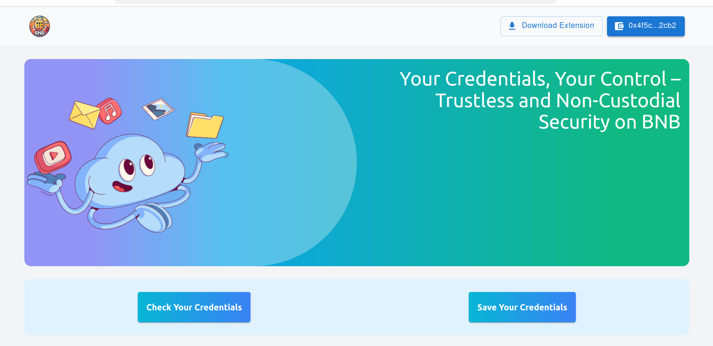
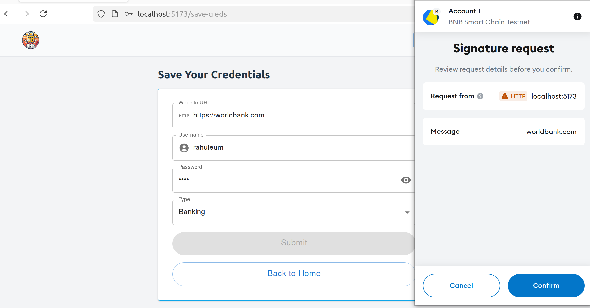
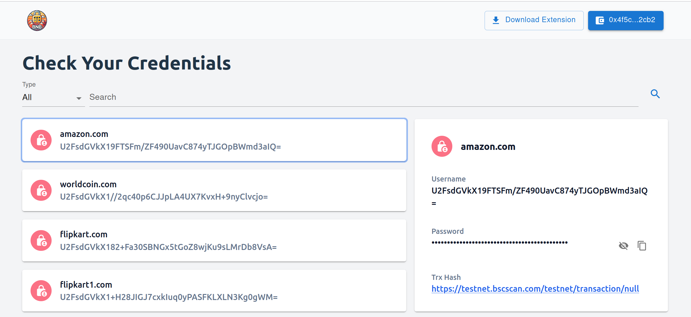
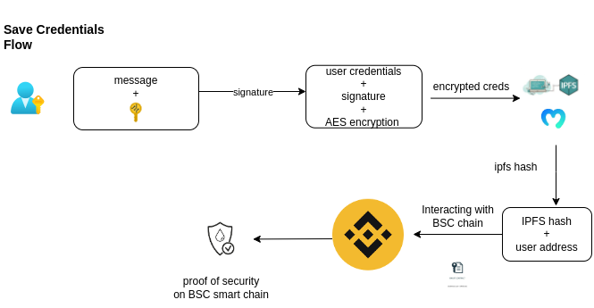
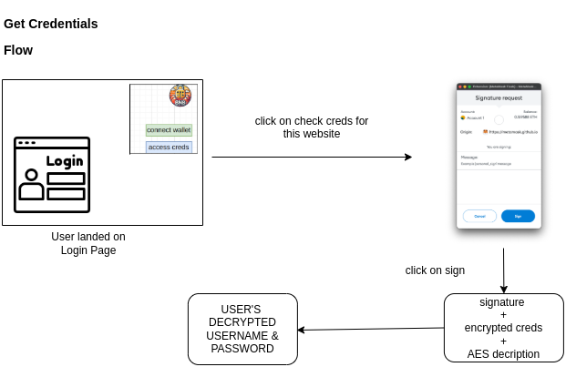

# About

A never-before-seen Web2 credentials management application. Store and access your credentials in a purely non-custodial and trustless way.

## Getting Started on local 

To run daap locally, you will need

- Node.js (v18 or above)
- Chrome Browser Or Chromium based browser
- Metamask Extension on Chrome Browser (Chromium based browser)

# back-end

1. clone this repo

```
git clone https://github.com/rahulEth/bnbPass.git
```

2.  go to api folder

```
cd api
```

3. copy .env.example to .env 

4. setup all the environment variables including moralis ipfs key, app-wallet private key
& wallet address, mongodb url.

5. 
```
npm install

npm run start

```
server would start on localhost:3000

# front-end

1. go into webapp folder

```
cd webapp

npm install

npm run build

npm run dev

```
Open [http://localhost:5173](http://localhost:5173) with your browser to see the result.

# browser-extension

1. go to extension folder

```
cd extension
```

2. build extension

```
npm run build
```

3. After Completing the build you can load that build (/dist folder) to Chrome Extension

   Follow this link: https://developer.chrome.com/docs/extensions/get-started/tutorial/hello-world#load-unpacked

Ta-da You are good to go and explore bnbPass dApp!










## Description

bnbPass is a web app and browser extension designed to store and access users' Web2 credentials in a trustless manner. When users secure their credentials, bnbPass prompts them to provide their signature to encrypt and store the information. We issue a proof of security on the [BNB blockchain](https://docs.bnbchain.org), allowing users to verify and ensure the safety of their data. No one other than the user can view or access the credentials, as everything is encrypted using the user's MetaMask wallet signature.

For example, when a user wants to log in to Amazon.com, our browser extension will prompt them to provide their signature to access and decrypt their Amazon.com credentials.

## Save Creds Flow



## Get Creds Flow




## Deployed Contract for bnbPass dapp [on BSC chain](https://docs.bnbchain.org/)

### TrsutlessProof

- https://testnet.bscscan.com/address/0xc03e265477CE9a2519CaB5e070f4855846AeD620#code